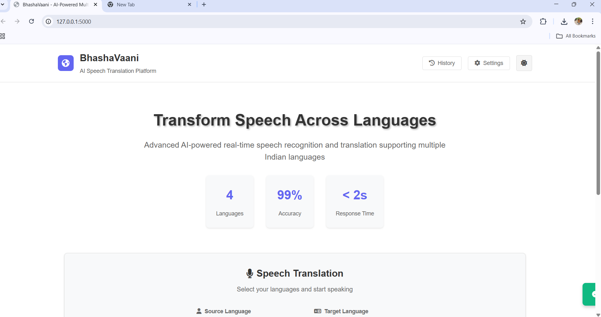
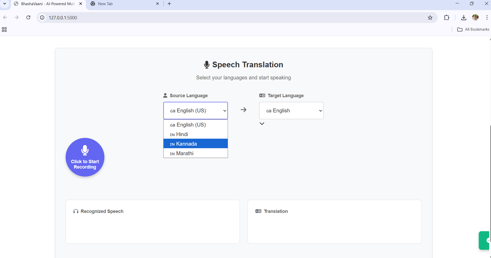
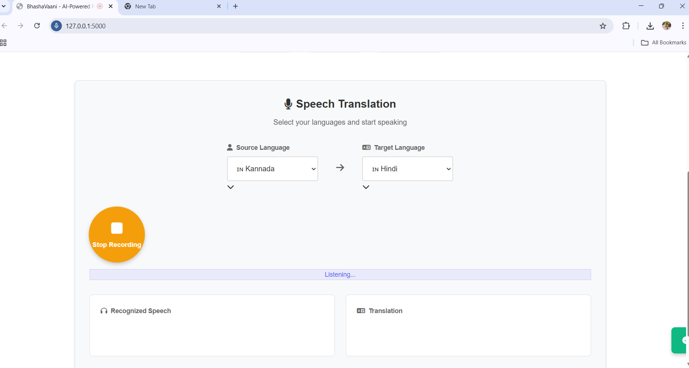
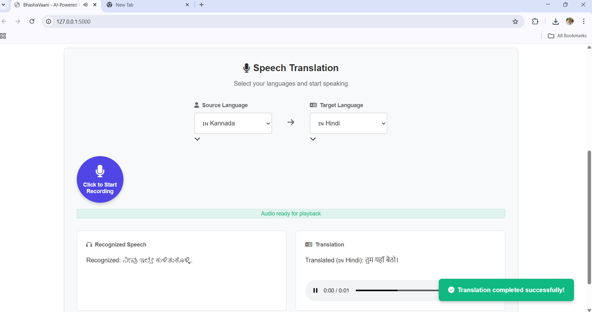
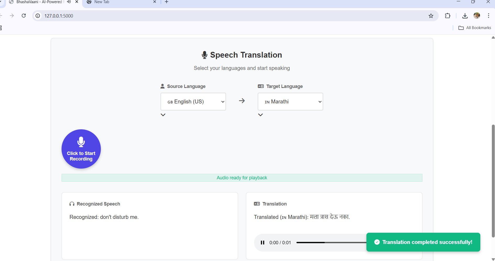
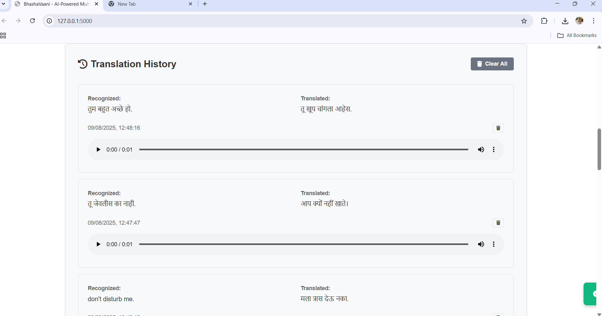

# BhashaVaani - Multilingual Speech Translation

A web application I built for real-time speech recognition and translation across multiple Indian languages. Supports English, Hindi, Kannada, and Marathi.

## Features

- **Speech Translation**: Real-time speech recognition and translation
- **Text-to-Speech**: Audio output in target language
- **History**: Save and replay previous translations
- **Responsive Design**: Works on desktop and mobile

## Tech Stack

- **Backend**: Flask, SpeechRecognition, googletrans, gTTS
- **Frontend: HTML5, CSS3, JavaScript ES6+

## Quick Start

1. Install dependencies:
```bash
pip install -r requirements.txt
```

2. Run the application:
```bash
python app.py
```

3. Open `http://localhost:5000` in your browser

## How to Use

1. Select input and output languages
2. Click record button and speak
3. Click stop to get translation
4. Listen to translated audio

## Challenges I Faced

- **Audio Processing**: Handling different browser audio formats
- **Real-time Translation**: Making it feel instant
- **UI/UX**: Creating a simple, intuitive interface

## Learning Outcomes 

 📸 Screenshots    

 
  
 
  
 


This project taught me about full-stack development, audio processing, API integration, and responsive design.

---

Developed to enable seamless communication across language barriers.